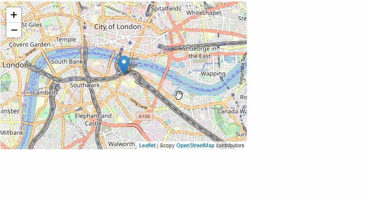

# Dash Leaflet

Dash Leaflet is a Dash component library.



## Notes and Caveat

* We are using yarn, which is why package-lock is deleted and we have yarn.lock
* React Leaflet setup requires you to include the CSS inside the index.html, which doesn't work well if you want to import it directly in your code (i.e. for webpack). Please see the source code for `Marker.react.js`, and this issue: https://github.com/PaulLeCam/react-leaflet/issues/255#issuecomment-261904061
* We need file-loader as a dev dependencies. Please see issue above.
* Icons don't serve correctly.
* The html elements passed by Dash are Connect objects, which for some reasons throws an error for the Popup component. Therefore, at the moment you can only pass a string, instead of an HTML element.


Get started with:
1. Install Dash and its dependencies: https://dash.plot.ly/installation
2. Run `python usage.py`
3. Visit http://localhost:8050 in your web browser

## Contributing

See [CONTRIBUTING.md](./CONTRIBUTING.md)

### Install dependencies

If you have selected install_dependencies during the prompt, you can skip this part.

1. Install npm packages
    ```
    $ npm install
    ```
2. Create a virtual env and activate.
    ```
    $ virtualenv venv
    $ . venv/bin/activate
    ```
    _Note: venv\Scripts\activate for windows_

3. Install python packages required to build components.
    ```
    $ pip install -r requirements.txt
    ```
4. Install the python packages for testing (optional)
    ```
    $ pip install -r tests/requirements.txt
    ```

### Write your component code in `src/lib/components/DashLeaflet.react.js`. 

- The demo app is in `src/demo` and you will import your example component code into your demo app.
- Test your code in a Python environment:
    1. Build your code
        ```
        $ npm run build:all
        ```
    2. Run and modify the `usage.py` sample dash app:
        ```
        $ python usage.py
        ```
- Write tests for your component.
    - A sample test is available in `tests/test_usage.py`, it will load `usage.py` and you can then automate interactions with selenium.
    - Run the tests with `$ pytest tests`.
    - The Dash team uses these types of integration tests extensively. Browse the Dash component code on GitHub for more examples of testing (e.g. https://github.com/plotly/dash-core-components)
- Add custom styles to your component by putting your custom CSS files into your distribution folder (`dash_leaflet`).
    - Make sure that they are referenced in `MANIFEST.in` so that they get properly included when you're ready to publish your component.
    - Make sure the stylesheets are added to the `_css_dist` dict in `dash_leaflet/__init__.py` so dash will serve them automatically when the component suite is requested.
- [Review your code](./review_checklist.md)

### Create a production build and publish:

1. Build your code:
    ```
    $ npm run build:all
    ```
2. Create a Python tarball
    ```
    $ python setup.py sdist
    ```
    This distribution tarball will get generated in the `dist/` folder

3. Test your tarball by copying it into a new environment and installing it locally:
    ```
    $ pip install dash_leaflet-0.0.1.tar.gz
    ```

4. If it works, then you can publish the component to NPM and PyPI:
    1. Cleanup the dist folder (optional)
        ```
        $ rm -rf dist
        ```
    2. Publish on PyPI
        ```
        $ twine upload dist/*
        ```
    3. Publish on NPM (Optional if chosen False in `publish_on_npm`)
        ```
        $ npm publish
        ```
        _Publishing your component to NPM will make the JavaScript bundles available on the unpkg CDN. By default, Dash servers the component library's CSS and JS from the remote unpkg CDN, so if you haven't published the component package to NPM you'll need to set the `serve_locally` flags to `True` (unless you choose `False` on `publish_on_npm`). We will eventually make `serve_locally=True` the default, [follow our progress in this issue](https://github.com/plotly/dash/issues/284)._
5. Share your component with the community! https://community.plot.ly/c/dash
    1. Publish this repository to GitHub
    2. Tag your GitHub repository with the plotly-dash tag so that it appears here: https://github.com/topics/plotly-dash
    3. Create a post in the Dash community forum: https://community.plot.ly/c/dash

